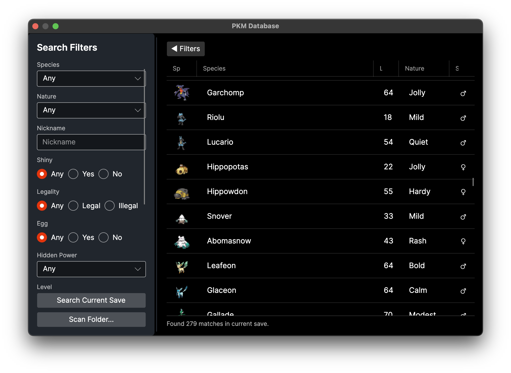
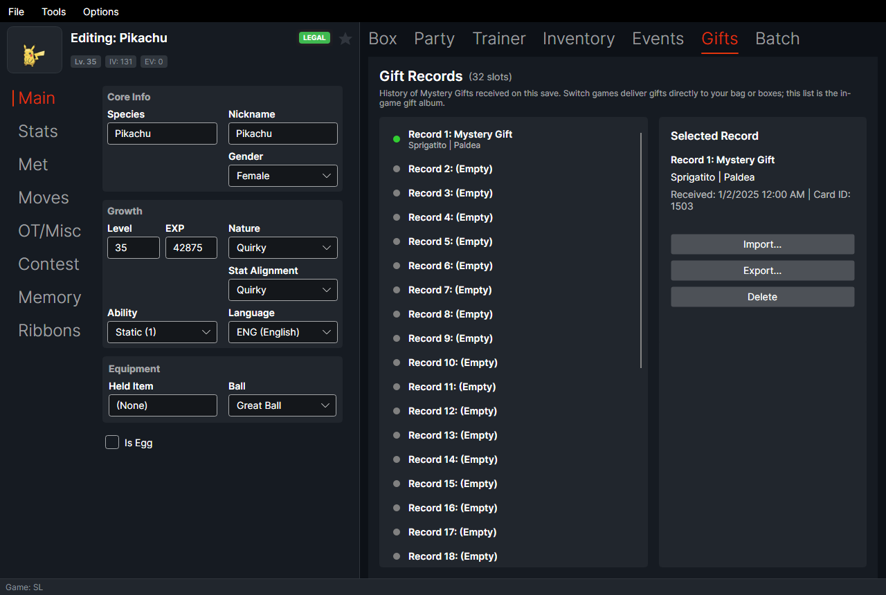

<div align="center">

# PKHeX Avalonia


A cross-platform port of [PKHeX](https://github.com/kwsch/PKHeX), the classic Pokémon save editor,
built with Avalonia so it runs on **Windows**, **macOS**, and **Linux**.

**[Download](#download) · [Project Structure](#project-structure) · [Features](#features) · [Building from Source](#building-from-source) · [Documentation](#documentation) · [Screenshots](#screenshots) · [Credits](#credits)**

</div>

---

## Download

Get the latest build for your platform from the [Releases](https://github.com/doctorllll/PKHeX/releases/latest) page. Every build is self-contained — no .NET install required.

| Platform | File |
|----------|------|
| macOS Apple Silicon | `PKHeX-Avalonia-osx-arm64-adhoc.zip`, or `PKHeX-Avalonia-osx-arm64-adhoc.dmg` |
| macOS Intel | `PKHeX-Avalonia-osx-x64-adhoc.zip`, or `PKHeX-Avalonia-osx-x64-adhoc.dmg` |

**macOS ad-hoc builds:** the default no-cost release is ad-hoc signed for code integrity, but it is
not Apple-trusted or notarized. On first launch, right-click → **Open**, or run:
```bash
xattr -dr com.apple.quarantine ~/Downloads/PKHeX.Avalonia.app
```
Developer ID/notarized builds have no suffix; `-selfsigned` builds are an optional intermediate
tier. See [`docs/packaging.md`](docs/packaging.md) for the signing tiers.
Homebrew installs strip this automatically via the cask's postflight step.

Package-manager installs (Homebrew cask, winget) are templated under `packaging/`, pending signed
builds — see [`docs/packaging.md`](docs/packaging.md).

The app checks GitHub Releases for updates on startup and shows a changelog after upgrading — see
[`docs/features.md`](docs/features.md#in-app-update-checker).

## Project Structure

The code is split into layers so the UI stays separate from the PKHeX logic:

| Project | What it does | Uses |
|---------|--------------|------|
| **PKHeX.Core** | Save, entity, and legality logic. Kept 1:1 with [upstream PKHeX](https://github.com/kwsch/PKHeX); never modified directly. | None |
| **PKHeX.Application** | Use-cases and service interfaces on top of Core. | Core |
| **PKHeX.Infrastructure** | File access, settings, backups, update checks, LiveHeX networking, and other OS bits. | Application, Core |
| **PKHeX.Presentation** | View-models and localization. No UI framework here. | Application, Core |
| **PKHeX.Avalonia** | The Avalonia UI: views, styles, themes, and the desktop app. | all of the above |
| **PKHeX.AutoMod** | Vendored Auto-Legality Mod legalization engine. | Core |

Tests live under `Tests/`: `PKHeX.Core.Tests`, `PKHeX.Avalonia.Tests`, and `PKHeX.Architecture.Tests`
(checks the layers above stay separate). Full layer map, dependency rules, and vendoring policy:
[`docs/development.md`](docs/development.md).

## Features

### Save editing

* Edit saves from Gen 1 to Gen 9, plus Let's Go, Legends: Arceus, BDSP, and Legends: Z-A.
* Edit any Pokémon: stats, moves, ribbons, memories, and more.
* Checks legality as you go and can fix illegal Pokémon for you.
* Import and export Pokémon files and Showdown sets.
* Move Pokémon between generations — format conversion is automatic.
* Search your boxes with the PKM, Mystery Gift, and Encounter databases.
* Edit many Pokémon at once with the batch editor.
* Game-specific editors under Tools, like Pokédex, Hall of Fame, and Secret Base.
* View and manage Switch received Mystery Gift records for Sword/Shield, BDSP, Legends: Arceus,
  and Scarlet/Violet. This manages the save's gift history—not BCAT delivery or redemption.

### PKHaX mode

PKHaX is the non-official editing mode for personal saves and ROM hacks. In the Avalonia app,
open **Options → Settings → Startup**, enable **Start in PKHaX mode**, save the setting, and
restart the app. The status bar and window title will show `PKHaX` when it is active.

For a one-time launch on macOS, close the app first and run:

```bash
open -a "/path/to/PKHeX.Avalonia.app" --args --hax
```

The direct executable form also works:

```bash
"/path/to/PKHeX.Avalonia.app/Contents/MacOS/PKHeX.Avalonia" --hax
```

Both `hax` and `--hax` are accepted. PKHaX intentionally permits data that the normal legality
checker rejects; make a backup before editing and do not use it when you need a conventionally
legal Pokémon.

### App experience

* **Themes:** Dark, Light, High Contrast, and Follow System, switchable at runtime — no restart.
* **Localization:** the app shell is translated into 9 languages, switchable live from the Options
  menu. [Contribute a translation.](CONTRIBUTING.md)
* **OS drag-and-drop:** drag entities out to Finder/Explorer, drop them onto a slot or box, or drop
  a save file anywhere on the window to open it. [Full details.](docs/features.md#os-drag-and-drop)
* **Accessibility:** keyboard-navigable box/party grids, accessible names on icon-only controls,
  and visible focus in every theme. See [`docs/accessibility.md`](docs/accessibility.md).
* **In-app update checker:** checks GitHub Releases on startup and shows a changelog after
  upgrading.
* **Save backup manager & diff:** automatic timestamped backups of every save you open or write,
  with a restore UI and a slot-by-slot diff (Tools → Backup Manager).
* **Whole-save legality audit:** runs the legality checker over every Pokémon in the save at once
  (Tools → Data → Legality Audit).
* **Platform-standard config/data directories**, with automatic one-time migration from the old
  next-to-executable location.

### Beyond WinForms parity

Tools that go past what the original WinForms PKHeX offers — full guide in
[`docs/features.md`](docs/features.md):

* **Auto-Legality Mod:** paste a Pokémon Showdown set and get back a legal, ready-to-inject
  Pokémon, using the same engine as the original Auto Legality Mod plugin
  (Tools → Showdown → Import Set, `Ctrl+T`).
* **Living Dex generator:** fills an entire Pokédex's worth of boxes with legal Pokémon using that
  same engine (Tools → Generate Living Dex).
* **LiveHeX:** read and write Pokémon directly on a running Nintendo Switch over Wi-Fi via
  [sys-botbase](https://github.com/olliz0r/sys-botbase) — no save export/import round-trip needed
  (Tools → LiveHeX). Requires a hackable/CFW console running sys-botbase.

## Building from Source

### Requirements
* [.NET 10 SDK](https://dotnet.microsoft.com/download/dotnet/10.0)

### Run
```bash
dotnet run --project PKHeX.Avalonia
```

### Build
```bash
dotnet build PKHeX.sln -c Release
```

### Test
```bash
dotnet test PKHeX.sln
```

### Publish (example: macOS ARM)
```bash
dotnet publish PKHeX.Avalonia -c Release -r osx-arm64 --self-contained -p:PublishSingleFile=true
```

See [`docs/development.md`](docs/development.md) for the full layer map, the PKHeX.Core 1:1 sync
policy, and the test suite overview.

## Documentation

* [`docs/features.md`](docs/features.md) — Auto-Legality Mod, Living Dex, LiveHeX, backup manager,
  legality audit, themes, localization, and more.
* [`docs/development.md`](docs/development.md) — build/test/run, Clean Architecture layer map,
  PKHeX.Core sync policy, UIVersion convention, test suite overview.
* [`docs/accessibility.md`](docs/accessibility.md) — keyboard shortcuts and screen-reader notes.
* [`docs/packaging.md`](docs/packaging.md) — how release installers/packages are built and signed.
* [`CONTRIBUTING.md`](CONTRIBUTING.md) — how to contribute a UI translation.
* [`docs/README.md`](docs/README.md) — full documentation index.

## Screenshots

<table>
<tr>
<td width="50%">

Pokémon editor and box view — the full editor next to the sprite box grid.


</td>
<td width="50%">

Inventory editor — edit items by pouch (Medicine, Balls, Berries, Mega Stones, and so on).


</td>
</tr>
<tr>
<td width="50%">

PKM Database — search your boxes with a filter rail you can resize or hide.


</td>
<td width="50%">

Save editors — Gen 1 to 9 plus game-specific tools under Tools → Save Editors.


</td>
</tr>
<tr>
<td colspan="2">

Switch Gift Records — inspect and manage received Mystery Gift history for Sword/Shield, BDSP,
Legends: Arceus, and Scarlet/Violet.


</td>
</tr>
</table>

## Credits

Built on the work of the [PKHeX team](https://github.com/kwsch/PKHeX).

* **Logic & Research:** [PKHeX](https://github.com/kwsch/PKHeX)
* **Avalonia port:** [PKHeX-Avalonia](https://github.com/realgarit/PKHeX-Avalonia) by Patrik Lleshaj and contributors
* **Auto-Legality Mod:** [PKHeX-Plugins](https://github.com/santacrab2/PKHeX-Plugins) by architdate, santacrab2, and contributors (see [`PKHeX.AutoMod/VENDORED.md`](PKHeX.AutoMod/VENDORED.md))
* **LiveHeX protocol:** [sys-botbase](https://github.com/olliz0r/sys-botbase) by olliz0r
* **QR Codes:** [QRCoder](https://github.com/codebude/QRCoder) (MIT)
* **Sprites:** [pokesprite](https://github.com/msikma/pokesprite) (MIT)
* **Arceus Sprites:** National Pokédex Icon Dex project and contributors.
